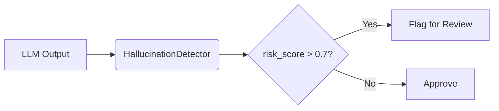

### **README.md**

# 🕵️ Hallucination Spotter

A lightweight Python library for detecting hallucinations in LLM outputs without API calls.

## 🔍 Features
- **Contradiction Detection**: Identifies conflicting numerical claims  
- **Vague Language Flagging**: Catches unsourced assertions  
- **Temporal Validation**: Detects impossible dates  
- **Risk Scoring**: 0-1 scale with configurable thresholds  

## 🚀 Quickstart
```bash
pip install hallucination-spotter
python -m spacy download en_core_web_sm
```

```python
from hallucinator import HallucinationDetector

detector = HallucinationDetector()
results = detector.analyze("The budget was $5M in 2022 and $5M in 2023")
print(f"Risk: {results['risk_score']:.2f}")
```

## 📋 CLI Usage
```bash
hspot "Some experts claim the event happened on February 30th" --threshold 0.7
```

## 📚 Documentation
- [Detection Rules](docs/detection_rules.md)  
- [Advanced Configuration](docs/quickstart.md)  

<sub>⚡ No API costs • 100% local execution • MIT Licensed</sub>
```

---

### **docs/detection_rules.md**
```markdown
# 🔬 Detection Rules

## 1. Contradictions
**Trigger**: Same number in conflicting contexts  
**Example**:  
`"The budget was $5M in 2022 and $5M in 2023"`  
→ Flags `('5', 2)`  

**Technical**:  
- Regex: `\b\d+\b`  
- Minimum repeats: 2 (configurable)  

## 2. Vague Language
**Patterns**:  
```python
r"\b(some\s+experts|studies\s+show|anonymous\s+sources|it\s+is\s+believed)\b"
```

**Examples**:  
- `"Some studies suggest..."` → **Flagged**  
- `"NASA confirmed..."` → **Ignored**  

## 3. Unverifiable Claims
**Conditions**:  
✅ Named entities (PERSON/ORG/DATE)  
❌ Missing attribution verbs  

**Example**:  
`"Dr. Smith claimed the temperature reached 500°C"` → **Verifiable**  
`"Dr. Smith observed 500°C"` → **Unverifiable**  

## 4. Date Validation
**Invalid Patterns**:  
- February 30th  
- April 31st  
- 2023-02-29  

**Detection**: Hybrid of:  
1. `datefinder` library  
2. Custom day-month validation  
```

---

### **docs/quickstart.md**
```markdown
# ⚡ Quick Configuration

## 1. Custom Thresholds
```python
detector = HallucinationDetector(
    contradiction_threshold=3,  # Require 3+ repeats
    vague_patterns=[r"\b(rumors|allegedly)\b"]  # Add custom patterns
)
```

## 2. Batch Processing
```python
from hallucinator.utils import batch_analyze

results = batch_analyze(
    ["Text 1", "Text 2"],
    num_workers=4  # Parallel processing
)
```

## 3. Integration Pipeline


## 📊 Interpreting Scores
| Score Range | Risk Level | Action |  
|------------|------------|--------|  
| 0.0-0.3    | Low        | Auto-approve |  
| 0.3-0.7    | Medium     | Human review suggested |  
| 0.7-1.0    | High       | Reject automatically |  
```

