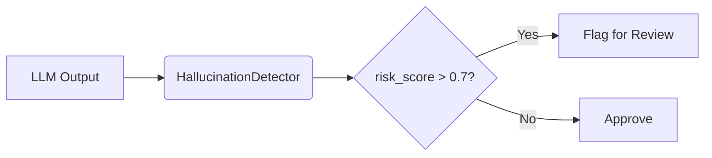

### **docs/quickstart.md**

# ⚡ Quick Configuration

## 1. Custom Thresholds
```python
detector = HallucinationDetector(
    contradiction_threshold=3,  # Require 3+ repeats
    vague_patterns=[r"\b(rumors|allegedly)\b"]  # Add custom patterns
)
```
## 2. Batch Processing
```python
from hallucinator.utils import batch_analyze

results = batch_analyze(
    ["Text 1", "Text 2"],
    num_workers=4  # Parallel processing
)
```

## 3. Integration Pipeline


## 📊 Interpreting Scores
| Score Range | Risk Level | Action |  
|------------|------------|--------|  
| 0.0-0.3    | Low        | Auto-approve |  
| 0.3-0.7    | Medium     | Human review suggested |  
| 0.7-1.0    | High       | Reject automatically |  
